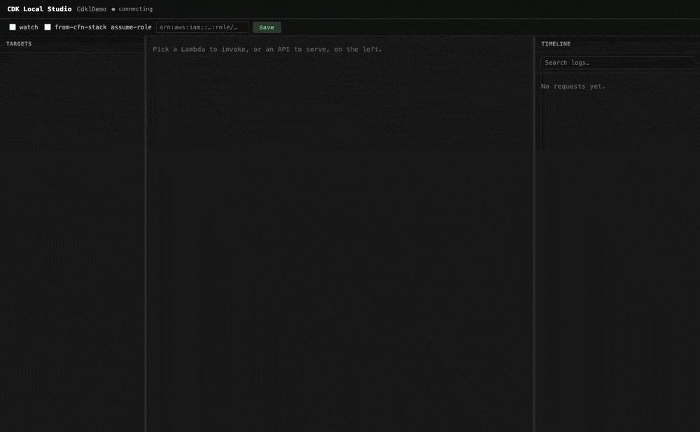

# cdk-local

[](https://www.npmjs.com/package/cdk-local)
[](https://www.npmjs.com/package/cdk-local)
[](https://github.com/go-to-k/cdk-local/actions/workflows/ci.yml)
[](./LICENSE)

**Run your CDK-built app locally, no deploy needed — standalone, or kept local while it reaches the real AWS resources and data it depends on, with no `.env` or local copies to maintain.**
A CDK-native alternative to `sam local`, covering Lambda, API Gateway, ECS, ALB-fronted services, and Bedrock AgentCore.


Or drive it all from a browser with `cdkl studio` — pick a target, invoke or serve it, and watch every request, response, and log line land on one live timeline:



## Quick start

Requires **Docker** (running) and **Node.js 20+**.

```bash
npm install -g cdk-local      # installs the `cdkl` command
cd your-cdk-app               # the directory holding cdk.json
cdkl invoke                   # pick a Lambda from the list, then run it locally
```

`cdkl` synths your CDK app and runs the selected resource locally in Docker. Run any command with no target and it opens an arrow-key picker, so you rarely type a CDK path.

**Add `--from-cfn-stack`** to bind to a deployed stack — your handler still runs locally in Docker, but reads and writes against the real DynamoDB / S3 / Secrets the deployed app uses (see [Why cdk-local](#why-cdk-local) below).

```bash
cdkl start-api --from-cfn-stack            # local API on real AWS data; JWT verified against the real Cognito User Pool
cdkl invoke MyStack/Fn --from-cfn-stack    # one Lambda against real DynamoDB / S3 / Secrets
```

## Why cdk-local

- **Zero-friction local execution** — run standalone with just Docker and your CDK app, no AWS account or deploy needed. Verify the parts of your app that don't touch AWS in seconds — handy as a zero-setup first run, or in CI where no credentials are available:
  - API Gateway routing and request shaping
  - Lambda authorizers, running in real local containers
  - pure handler logic — validation, transforms, branching
- **Iterate against your real deployed stack — including its data.** `--from-cfn-stack` reads the deployed CloudFormation stack and injects its real ARNs and Secret values into the container — no `.env` file to maintain, no manual ARN copy-paste — so you stay on the real DynamoDB rows, S3 objects, Cognito users, and Secret values your IAM credentials reach. An offline emulator can fake the API surface, but you'd still own the cost of seeding it:
  - dumping production data into a local DB
  - mirroring Secret values into local Secrets Manager
  - anonymizing fixtures across schema changes
  - scripting realistic Cognito test users

## What runs locally

cdk-local runs your **application compute** in Docker, using your CDK app as the source of truth. It deliberately does NOT emulate AWS managed services: your code reaches DynamoDB / S3 / Secrets Manager / Cognito / SNS / SQS / etc. as **real AWS** through your IAM credentials (or pass `--assume-role <arn>` to assume a different role). Add `--from-cfn-stack` to also bind env vars to a deployed stack's real ARNs and Secret values.

The locally executable resources are listed under [Supported resources](#supported-resources).

## Commands

Run every `cdkl` command from your CDK project root (the directory containing `cdk.json`).

Run any command with no target for an arrow-key picker (`invoke` / `invoke-agentcore` / `run-task` pick one; `start-service` / `start-alb` / `start-api` multi-select). Or name a target — the CDK display path (recommended) or a stack-qualified logical ID (`MyStack:Fn1234ABCD`, the SAM-compatible form); single-stack apps may drop the stack prefix.

```bash
cdkl invoke MyStack/Fn --event ./event.json   # Lambda (ZIP or container image)
cdkl run-task MyStack/Task                     # ECS task, run once
cdkl start-service MyStack/Worker              # ECS service replicas (no load balancer)
cdkl start-alb MyStack/WebAlb                  # ECS behind an ALB (front-door per listener)
cdkl start-api MyStack/Api                     # API Gateway REST v1 / HTTP v2 / WebSocket + Function URLs
cdkl invoke-agentcore MyStack/Agent            # Bedrock AgentCore Runtime (HTTP / MCP / A2A / AGUI)
cdkl list                                      # every runnable target, grouped by command (alias: ls)
cdkl studio                                    # interactive web console over every target
```


`invoke` runs one Lambda in a real RIE container; the options you reach for most:

```bash
cdkl invoke MyStack/Fn --event ./event.json             # run with a JSON event payload
cdkl invoke MyStack/Fn --env-vars ./env.json            # overlay env vars (SAM-shape file)
cdkl invoke MyStack/Fn --from-cfn-stack                 # bind env to the deployed stack's real values
cdkl invoke MyStack/Fn --from-cfn-stack --assume-role   # ...and run as its deployed execution role
```

- **`start-api`** serves one HTTP server per API; a bare `start-api` in a multi-stack app needs `--all-stacks` or `--stack <name>`.
- **`run-task`** / single-replica **`start-service`** publish declared container ports on the host (a privileged port like 80 auto-remaps to a free high host port with a WARN; `--host-port <container>=<host>` pins a specific one). **`start-service`** / **`start-alb`** also list each host URL in a `Service endpoints:` banner after boot so the access URL stays visible.
- **`start-alb`** stands up the ECS service(s) behind an ALB plus a host-side front-door on each listener port, honoring all six listener-rule conditions, weighted forwards, redirect / fixed-response actions, mixed ECS + Lambda targets, `authenticate-cognito` / `authenticate-oidc` actions (local Bearer-JWT enforcement), and WebSocket `Upgrade` proxying to ECS targets ([details](docs/cli-reference.md#cdkl-start-alb-run-an-alb-fronted-service-locally)).
- **`invoke-agentcore`** invokes a Bedrock AgentCore Runtime agent locally — container or `fromCodeAsset` / `fromS3` managed runtime, all four runtime protocols (HTTP and AGUI on 8080, MCP on 8000, A2A on 9000; SSE and WebSocket are HTTP wire-shape variants on the same 8080 container), with `customJwtAuthorizer` and `--sigv4` enforcement ([details](docs/cli-reference.md#cdkl-invoke-agentcore-run-bedrock-agentcore-runtime-agents-locally)).
- **`studio`** opens a local web console over the same synthesized targets — a point-and-click front over the same CLI runners. Takes no target (it lists them all). Flags + in-UI controls: [Web console — `cdkl studio`](#web-console--cdkl-studio).
- Non-TTY (CI / pipes): every command except a bare `start-api` needs an explicit target.

Full flags, precedence, and `--from-cfn-stack` resolution: [docs/cli-reference.md](docs/cli-reference.md) and [docs/local-emulation.md](docs/local-emulation.md).

### Web console — `cdkl studio`

`cdkl studio` is a point-and-click front over the same runners: pick a Lambda or AgentCore runtime and invoke it, start / stop a `start-api` / `start-alb` / `start-service` serve, and watch invocations + captured serve requests stream onto a live timeline with their bound logs. It takes no target — it lists them all.

```bash
cdkl studio                                  # open the console (launches your browser)
cdkl studio --no-open                        # don't launch a browser; just print the URL
cdkl studio --studio-port 8200               # pin the port (default: auto-assigned)
cdkl studio --from-cfn-stack                 # bind the whole session to the deployed stack
cdkl studio --from-cfn-stack --assume-role   # ...and run every target as its deployed role
cdkl studio --watch                          # serves started from the UI hot-reload on source changes
cdkl studio --stack 'dev/*'                  # scope the displayed target list (multi-stack apps)
```

`--from-cfn-stack` / `--assume-role` / `--watch` are session-global and also editable live from the Session bar — they apply to every invoke / serve you start from the UI. The standard synth flags (`--app` / `--profile` / `--region` / `-c`) work here too.

Each target's composer surfaces its per-run options as controls — a Lambda's `--env-vars` as KEY/VALUE or JSON, ALB `--tls` / `--lb-port`, ECS `--max-tasks` / `--host-port`, an AgentCore runtime's `--ws` / `--sigv4` / `--bearer-token` — plus an **All options** panel listing the underlying command's full flag set with a raw extra-args input for anything not surfaced as a control. An ECS service whose image is pinned to a deployed registry (local edits don't take effect) also gets a Dockerfile picker that rebuilds it from local source.

### Deployed stack binding — `--from-cfn-stack`

`--from-cfn-stack` binds to the deployed CloudFormation stack whose name matches your CDK stack. The bare form resolves the stack name from the target; pass an explicit name only when the deployed CFn stack name differs (e.g. CDK's `stackName` prop was overridden):

```bash
cdkl invoke MyStack/Fn --from-cfn-stack                              # bare: uses resolved stack name
cdkl invoke MyStack/Fn --from-cfn-stack MyExplicitCfnName            # explicit when names differ
cdkl invoke MyStack/Fn --from-cfn-stack --stack-region eu-west-1     # cross-region CFn client
cdkl invoke MyStack/Fn --from-cfn-stack --assume-role                # auto-assume deployed execution role
```

Substitutes `Ref` / `Fn::ImportValue` / `Fn::GetStackOutput` in env vars with the deployed physical IDs / exports, decrypts `AWS::SSM::Parameter::Value` entries (kept off the `docker run` argv), and resolves same-stack ECR `ContainerUri` to the deployed image. `Fn::GetAtt` in the Lambda's own env is recovered from the deployed function's resolved `Environment.Variables` via `lambda:GetFunctionConfiguration`. Full resolution rules: [docs/cli-reference.md#cloudformation-driven-env-recovery---from-cfn-stack](docs/cli-reference.md#cloudformation-driven-env-recovery---from-cfn-stack).

### Environment variables — `--env-vars`

Every command accepts `--env-vars <file>`, a SAM-shape JSON file that overlays the container's environment — point a Lambda function or ECS container at a different backend for a local run, or supply a value the synthesized template only knows as an intrinsic:

```bash
cdkl invoke MyStack/Fn --env-vars ./env.json
cdkl start-service MyStack/MyService --env-vars ./env.json
cdkl start-alb MyStack/MyAlb --env-vars ./env.json
```

```json
{
  "Parameters": { "LOG_LEVEL": "debug" },
  "MyStack/Fn": { "TABLE_ENDPOINT": "http://localhost:8000", "PROD_FEATURE_FLAG": null },
  "AppContainer": { "DB_HOST": "host.docker.internal", "DB_PORT": "13306" }
}
```

Each top-level JSON key picks which target to overlay:

| Target | Key shape | Notes |
| --- | --- | --- |
| Every target | `Parameters` | Reserved literal; applied first to every container |
| Lambda / AgentCore Runtime | CDK construct path (e.g. `MyStack/Fn`) | From `Metadata['aws:cdk:path']` of the resource; prefix-matched (`MyStack/Fn` also catches `MyStack/Fn/Resource`) |
| Lambda / AgentCore Runtime | CloudFormation logical ID (e.g. `MyStackFn1A2B3C`) | Top-level resource key in the synthesized template; exact match |
| ECS container | Container Name (e.g. `AppContainer`) | `ContainerDefinitions[].Name` in the synthesized TaskDefinition — explicitly set via the `containerName` option of `taskDef.addContainer(id, { containerName, ... })`, or defaults to the construct id (first arg of `addContainer`) when omitted. The TaskDefinition's CDK path / logical ID is NOT accepted as a key — it would identify the TaskDef but not which container's env block to overlay |

`--env-vars` overlays the env block after the template's literals and any resolved ECS `Secrets[]` have been applied. A per-target key (from the table above) wins over `Parameters`. A `null` value clears the key — use the JSON literal `null`, not the string `"null"`.

`--env-vars` can be combined with `--from-cfn-stack`: the latter resolves intrinsics (`Ref` / `Fn::ImportValue` / `Fn::GetStackOutput` / `Fn::GetAtt`) against the deployed stack first, then `--env-vars` overlays your overrides on top. Running standalone (no `--from-cfn-stack`), env vars whose template value is an intrinsic can't be resolved and are dropped with a warning — `--env-vars` is how you supply a concrete value for them.

When pointing a container at a tunneled VPC resource (e.g. an Aurora cluster reached via a local port forward), use `host.docker.internal` instead of `127.0.0.1` — `127.0.0.1` inside the container is the container itself, not the host where the tunnel listens.

### Hot reload — `--watch`

```bash
cdkl start-api --watch                       # reload API routes on save
cdkl start-service --watch                   # roll ECS replicas on save
cdkl start-alb --watch                       # roll ALB-fronted ECS replicas on save
cdkl invoke-agentcore --ws --watch           # reload an open /ws agent session
```

Edit a handler and the next request hits the new code — no server restart. ECS reloads roll replicas one at a time so the service stays available across the reload (an external request stream against the ALB listener port sees zero connection refusals, even on multi-replica services). Synth failures keep the previous replica(s) serving. Honors `cdk.json`'s `watch.include` / `watch.exclude` globs, so no separate `cdk watch` process is needed.

Reload classifier (interpreted-language fast path vs Dockerfile rebuild), shadow-replica TCP-probe timeout (`--shadow-ready-timeout`), and per-runtime caveats: [docs/local-emulation.md#hot-reload---watch](docs/local-emulation.md#hot-reload---watch).

### Local build override — `--image-override`

`cdkl start-service` / `cdkl start-alb` against a service whose CDK source uses `ContainerImage.fromEcrRepository(...)` (typical under `--from-cfn-stack`) runs the deployed image bytes locally — local source edits don't take effect, even with `--watch`. `--image-override` swaps in a local `docker build` so iteration still works while real DynamoDB / Secrets / SSM stay wired in.

Boot in a TTY and the command walks each detected pinned target with an interactive Dockerfile picker:

```bash
cdkl start-alb --from-cfn-stack    # interactive boot prompt for each pinned target
```

Or name them up-front (CI / scripted setups), with build inputs:

```bash
cdkl start-alb --from-cfn-stack \
  --image-override AppService=./services/app/Dockerfile \
  --image-build-arg NODE_ENV=production \
  --image-build-secret npmrc=./.npmrc \
  --image-target builder
```

Per-service build inputs (`<svc>:KEY=VAL` for build-arg / build-secret, `<svc>=stage` for target), monorepo recipes, private-registry npmrc threading, `--no-interactive-overrides` / `--strict-overrides`, and the `--watch` rebuild loop: [docs/local-emulation.md#local-build-override---image-override](docs/local-emulation.md#local-build-override---image-override).

### start-service vs start-alb — which one?

Most CDK ECS apps boot multiple replicas behind an ALB. cdk-local exposes each layer separately so you can target the slice you care about:

| Goal | Command | How to reach |
|---|---|---|
| App logic / DB / response shape — hit the handler directly | `cdkl start-service --max-tasks 1 --host-port 80=8080` | `curl http://127.0.0.1:8080/...` |
| ALB routing — listener rules, host-header / path / method, default actions, redirects, fixed-response, weighted forwards, authenticate-cognito / authenticate-oidc | `cdkl start-alb --lb-port 443=8443 --tls` | `curl -H 'Host: api.example.com' https://127.0.0.1:8443/...` |
| Multi-replica rolling-reload + Cloud Map service discovery | `cdkl start-service` (multi-replica default) | Sibling container on the `cdkl-svc-` network |

**Why the extra flags on the simple case?** The template's `DesiredCount` (typically 3 in production) is honored locally by default, but N replicas can't all bind the same host port — so `start-service` skips host publishing for multi-replica runs and the app is reachable only from inside the `cdkl-svc-` docker network. To get the simple `curl http://127.0.0.1:...` access path:

- `--max-tasks 1` clamps the local replica count to 1 without touching your CDK code.
- A privileged declared host port (`< 1024`, e.g. 80) is auto-remapped to a free high host port — with a WARN naming the remap — because macOS Docker Desktop refuses to publish privileged ports and a `< 1024` host port needs root. `--host-port <containerPort>=<hostPort>` pins a specific host port instead.

`start-alb` uses the symmetric `--lb-port <listenerPort>=<hostPort>` for privileged listener ports like 80 / 443, and `--tls` (or `--tls-cert` / `--tls-key`) to terminate TLS locally instead of serving the HTTPS listener over plain HTTP (the default). Full resolution model: [docs/cli-reference.md](docs/cli-reference.md#cdkl-start-alb-run-an-alb-fronted-service-locally).

## Supported resources

| Resource | Local execution |
|----------|-----------------|
| Lambda functions (ZIP, container image, Function URLs) | `invoke` — every current Lambda runtime |
| API Gateway (REST v1, HTTP v2, WebSocket) + Lambda Function URLs | `start-api` |
| ECS task definitions | `run-task` |
| ECS services | `start-service` |
| Cloud Map / Service Connect registry | service discovery between local replicas |
| ALB-fronted ECS / Lambda services | `start-alb` — HTTP / HTTPS listeners, all six listener-rule conditions, weighted forwards, redirect / fixed-response, mixed ECS + Lambda targets, authenticate-cognito / authenticate-oidc (local Bearer-JWT enforcement), WebSocket Upgrade |
| Bedrock AgentCore Runtime agents | `invoke-agentcore` — container + `fromCodeAsset` / `fromS3` artifacts, HTTP / MCP / A2A / AGUI |

Lambda runs on every current AWS Lambda runtime — Node.js (18/20/22/24), Python (3.11–3.14), Ruby (3.2/3.3), Java (8.al2/11/17/21), .NET (6/8), and the OS-only `provided.al2` / `provided.al2023`. The retired `go1.x` runtime is rejected with a pointer to migrate to `provided.al2023`.

## Programmatic use

cdk-local also exports its commands as Commander factories so a host project can embed it into its own CLI, register custom state sources alongside the built-in `--from-cfn-stack`, and rebrand the embedded commands. See [docs/library-mode.md](docs/library-mode.md) for the API and an example.

## License

Apache-2.0
