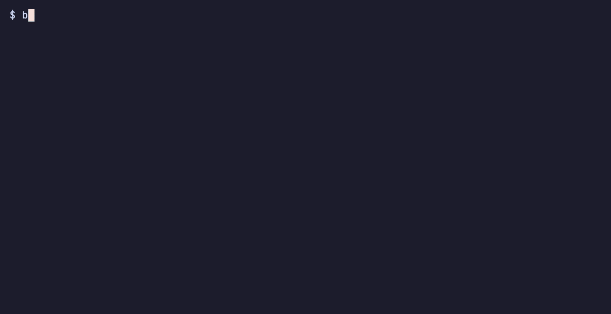

# cdk-local

Local runner for your CDK app's Lambda functions, API Gateway, and ECS tasks/services. Run it with no AWS account, or bind it to your deployed stack to hit real AWS resources and data. A native, CDK-first alternative to `sam local`.


## Why cdk-local

Two pains, one tool:

- **Zero-friction local execution.** No AWS account, no IAM access, no deploy — just Docker and your CDK app. Onboard new engineers, review a PR by actually running its code, or work on an OSS CDK sample without owning the maintainer's AWS account.
- **Iterate against your real deployed stack — including its data.** `--from-cfn-stack` injects real ARNs, Secret values, and IAM credentials straight from CloudFormation into the local container — no `.env` file to maintain, no manual ARN copy-paste. Your local Lambda hits the same DynamoDB rows, S3 objects, Cognito users, Secret values, and anything else your IAM credentials reach through public AWS APIs that the deployed app sees. An offline emulator can fake the API surface, but you'd still own the cost of seeding it:
  - dumping production data into a local DB
  - mirroring Secret values into local Secrets Manager
  - anonymizing fixtures across schema changes
  - scripting realistic Cognito test users

  cdk-local skips all of that by keeping you on the real thing.

cdk-local deliberately does NOT emulate AWS managed services. The bet is: keep dependencies real, swap only the compute layer.

It also picks up where `sam local` leaves off:

- **CDK-native** — point it at your CDK app's `cdk.json`. No SAM templates, no extra config files.
- **Wider coverage** — Lambda (ZIP + container image, plus Function URL), API Gateway REST v1 / HTTP v2 / WebSocket API, ECS run-task, ECS service with Service Connect + Cloud Map.
- **Real container images** — Lambda code runs in the real `public.ecr.aws/lambda/*` base image via Lambda Runtime Interface Emulator (RIE). ECS tasks run as real Docker containers. The only dependency is Docker.

## What runs locally, what doesn't

cdk-local runs your **application compute** locally in Docker, using your CDK app as the source of truth. It does NOT emulate AWS managed services.

**Runs locally (application compute):**

- **Lambda functions** — your code in a real `public.ecr.aws/lambda/*` container via the Lambda Runtime Interface Emulator
- **HTTP APIs & Function URLs** — API Gateway REST v1 / HTTP v2 / WebSocket and Lambda Function URLs served by a local HTTP server
- **ECS** — tasks and services as real Docker containers (awsvpc / Service Connect / Cloud Map registry)
- **Authorizers** — Lambda authorizers, Cognito User Pool JWT verification, IAM SigV4 verification

**Calls real AWS (managed services):**

- DynamoDB / S3 / Secrets Manager / SSM / SNS / SQS / Kinesis / EventBridge / Step Functions / etc.
- Your Lambda code talks to real AWS via your IAM credentials (`--assume-role` or `--from-cfn-stack` to bind to a deployed stack)
- If you want offline emulation of managed services, pair cdk-local with a service emulator like LocalStack — cdk-local does not bundle one.

## Install

```bash
npm install -g cdk-local
```

This installs the `cdkl` command.

## Two ways to use it

### 1. Standalone — no AWS deployment required

Point cdk-local at your CDK app. It synths your stack and runs Lambda functions, API Gateway routes, and ECS tasks locally with Docker. No AWS credentials needed for the basic flow.

#### Lambda — `invoke`

Invoke a single Lambda function with an event payload.

```bash
cdkl invoke MyStack/MyFunction --event ./event.json
```



#### HTTP APIs & Function URLs — `start-api`

Serve your app's HTTP surface locally — API Gateway routes (REST v1 / HTTP v2 / WebSocket) and Lambda Function URLs — on a local HTTP server.

```bash
# Single-stack app: serve every API in the stack (each on its own port)
cdkl start-api

# Or target one API
cdkl start-api MyStack/MyApi
```

In a multi-stack app, a bare `cdkl start-api` errors out rather than serving every stack's API at once (so a side-stack's API is never booted by accident). Either serve them all explicitly, or pick one stack with the first selector you supply:

```bash
# Serve every stack's API (each on its own port)
cdkl start-api --all-stacks
```

- `--stack <name>` — the synth stack name, matched against your CDK app.
- `--from-cfn-stack <name>` — the deployed CloudFormation stack name; doubles as the stack selector (see [section 2](#2-bound-to-a-deployed-stack)).
- a stack-qualified target like `MyStack/MyApi` — the `MyStack` prefix selects the stack.

`--all-stacks` is mutually exclusive with those single-target selectors (the bare `--from-cfn-stack` flag stays compatible). See [docs/cli-reference.md](docs/cli-reference.md) for the full precedence rules.

#### ECS — `run-task` / `start-service`

Run an ECS task definition once, or start a long-running service with Service Connect / Cloud Map registry.

```bash
cdkl run-task MyStack/MyTask
cdkl start-service MyStack/MyService
```

There is no cluster command — locally, Docker is the placement target a cluster abstracts away, so there is nothing to run. Both commands accept an optional `--cluster <name>` to set the cluster name surfaced to `ECS_CONTAINER_METADATA_URI_V4` (also used as the local Docker network prefix). See [docs/cli-reference.md](docs/cli-reference.md) for the full ECS option list.

Use this for fast iteration on Lambda code, API routing checks, and container task smoke tests.

### 2. Bound to a deployed stack

Once your stack is deployed to AWS (via the AWS CDK CLI or any other tool), pass `--from-cfn-stack <StackName>` and cdk-local reads the deployed CloudFormation stack to inject real ARNs, Secrets values, and IAM credentials (resolved from your current AWS profile) into the local execution.

For Lambda (`invoke`, `start-api`), this also recovers env-var values that CloudFormation resolved at deploy time but `ListStackResources` does not expose — e.g. `SIBLING_ARN: Fn::GetAtt <OtherFunction>.Arn`. cdk-local reads the deployed function's own resolved `Environment.Variables` (via `lambda:GetFunctionConfiguration`) and fills those keys, so a Lambda that calls a sibling Lambda by ARN runs locally without a manual `--env-vars` entry. (These values enter the local container env in plaintext; Lambda env vars are a non-secret property, so this exposes nothing the deployed function doesn't already surface to any caller with `lambda:GetFunctionConfiguration`.)

#### HTTP APIs & Function URLs — `start-api` (the headline use case)

A local API talking to real AWS — point a frontend at it for end-to-end debugging, including real Cognito JWT verification.

```bash
cdkl start-api MyStack/MyApi --from-cfn-stack MyStack

# Typical shape — the bare flag auto-resolves to the routed stack's
# name (here `MyStack`). Pass an explicit value only when the deployed
# CFn stack name differs from the CDK stack name.
cdkl start-api MyStack/MyApi --from-cfn-stack
```

#### Lambda — `invoke`

Single-function debugging against real upstreams (DynamoDB rows, S3 objects, Secrets values).

```bash
cdkl invoke MyStack/MyFunction --event ./event.json --from-cfn-stack MyStack
```

#### ECS — `run-task` / `start-service`

Container workloads running locally against real ARNs / Secrets / IAM credentials from the deployed stack.

```bash
cdkl run-task MyStack/MyTask --from-cfn-stack MyStack
cdkl start-service MyStack/MyService --from-cfn-stack MyStack
```

Use this for production debugging, integration verification with real AWS resources, and validating real IAM permissions before deploy.

## `--watch` (hot reload)

Pass `--watch` to `cdkl start-api` and the server hot-reloads when your CDK app's synth output (or any routed Lambda's asset directory) changes:

```bash
cdkl start-api MyStack/MyApi --watch
```

- 500 ms debounced [chokidar](https://github.com/paulmillr/chokidar) file watcher on `cdk.out/` + every routed Lambda's asset dir.
- Re-synths and re-discovers routes on each firing — adding a new route to your CDK app shows up locally on save.
- Synth failures keep the previous version serving (warn-and-continue, never crashes the server).
- Compatible with `--from-cfn-stack`: each reload re-reads the deployed CloudFormation stack so a deploy event picks up new ARNs without restarting the server.

See [docs/local-emulation.md](docs/local-emulation.md#hot-reload---watch) for the full lifecycle, file-list update semantics, and known limitations.

## Override env vars without a state source

When env-var values in your CDK template are CloudFormation intrinsics (`Ref`, `Fn::GetAtt`, `Fn::ImportValue`), cdk-local cannot resolve them without a state source — it drops them with a warning that names the affected key. To inject literal values instead, use `--env-vars <file>` (SAM-compatible JSON shape):

```json
{
  "Parameters": { "LOG_LEVEL": "debug" },
  "MyStack/MyFunction": {
    "SECRET_ARN": "arn:aws:secretsmanager:us-east-1:123456789012:secret:MySecret-abc123",
    "TABLE_NAME": "my-table"
  }
}
```

```bash
cdkl invoke MyStack/MyFunction --event ./event.json --env-vars ./env.json
```

- `Parameters` applies to every function / container; function-specific blocks override it.
- For Lambda (`invoke`, `start-api`), function-specific keys can be either a **CDK display path** (`MyStack/MyFunction` — recommended for new files; same form `cdkl invoke` accepts as a target) or a **CloudFormation logical ID** (`MyFunctionLogicalId1234ABCD` — named in `cdk.out/<Stack>.template.json`, the SAM-compatible form). Both coexist; if both are listed for the same function, the later JSON entry wins (matching SAM's apply-in-order semantics).
- For ECS (`run-task`, `start-service`), function-specific keys are container names from the task definition's `ContainerDefinitions[].Name` field.
- The file format matches `sam local invoke --env-vars`, so an existing SAM env-vars file (logical-ID keys) works unchanged.

## Supported resources

| Resource | Local execution support |
|----------|------------------------|
| `AWS::Lambda::Function` (ZIP) | ✓ |
| `AWS::Lambda::Function` (container image) | ✓ |
| `AWS::Lambda::Url` | ✓ |
| `AWS::ApiGateway::*` (REST v1) | ✓ |
| `AWS::ApiGatewayV2::*` (HTTP API + WebSocket) | ✓ |
| `AWS::ECS::TaskDefinition` (run-task) | ✓ |
| `AWS::ECS::Service` (start-service) | ✓ |
| `AWS::ServiceDiscovery::*` (Cloud Map / Service Connect) | ✓ |

## Programmatic use

cdk-local also exports its commands as Commander factories so a host project can embed it into its own CLI, register custom state sources alongside the built-in `--from-cfn-stack`, and rebrand the embedded commands under its own name. See [docs/library-mode.md](docs/library-mode.md) for the API and an example.

## License

Apache-2.0
